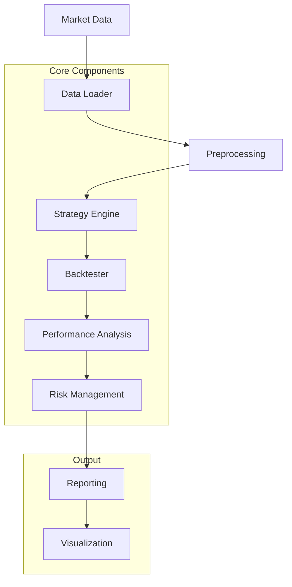

# Trading Strategy Backtesting System Flow

## Flow Description

1. **Market Data**: Raw market data from various sources
2. **Data Loader**: Loads and normalizes data from different formats
3. **Preprocessing**: Cleans and prepares data for analysis
4. **Strategy Engine**: Applies trading strategies to processed data
5. **Backtester**: Simulates strategy performance on historical data
6. **Performance Analysis**: Evaluates strategy metrics and KPIs
7. **Risk Management**: Applies risk controls and limits
8. **Reporting**: Generates comprehensive performance reports
9. **Visualization**: Creates interactive charts and dashboards